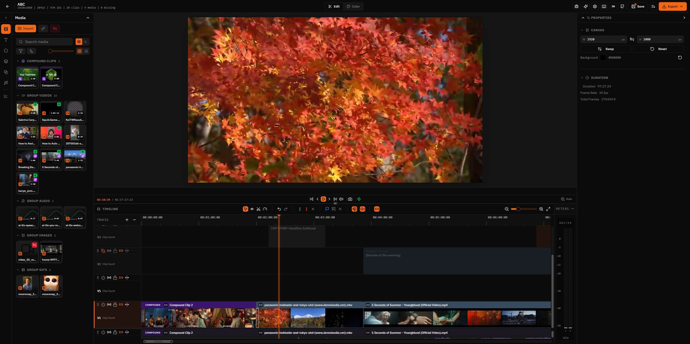
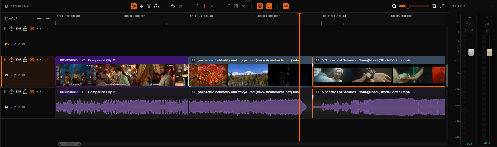
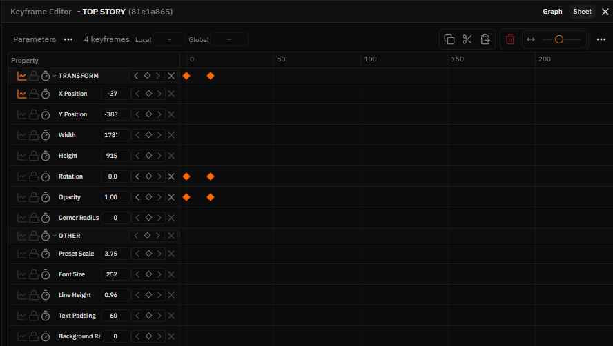
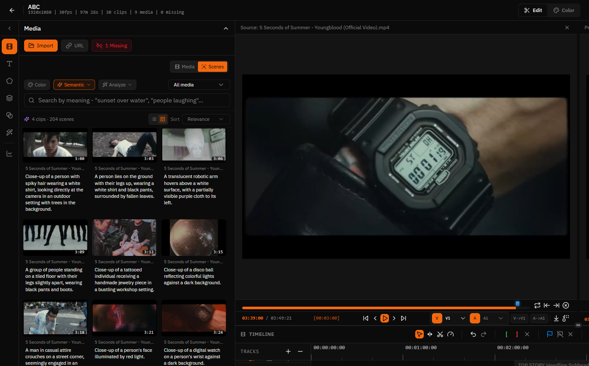
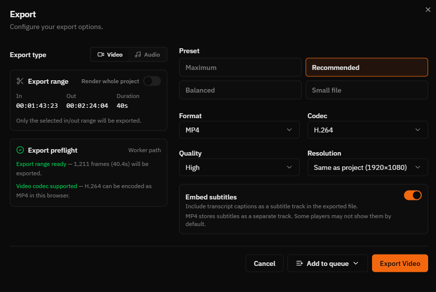
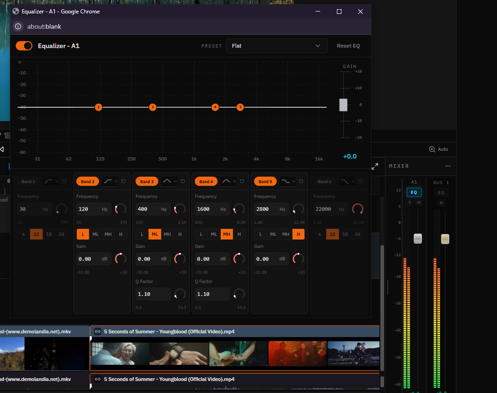

# FreeCut

**[freecut.net](http://freecut.net/)**

**Edit videos. In your browser.**

[](LICENSE)
[](https://discord.gg/aQtQ7NyUBd)



FreeCut is a browser-based, multi-track video editor. No install, no uploads:
projects and media stay local, while editing, preview, analysis, transcription,
AI generation, and export run in the browser through WebGPU, WebCodecs, Web
Workers, OPFS, and the File System Access API.

FreeCut writes projects, linked media metadata, thumbnails, waveforms, generated
AI assets, transcripts, scene cuts, and caches as plain files inside a workspace
folder you choose on disk.

## User Guide

New to FreeCut? Start with the [user guide](https://freecut.net/docs).

## Community

Join the [FreeCut Discord](https://discord.gg/aQtQ7NyUBd) to share edits,
request features, report bugs, and give feedback on browser-based editing workflows.

## Screenshots

<table>
  <tr>
    <td width="50%">
      <strong>Timeline</strong><br />
      
    </td>
    <td width="50%">
      <strong>Keyframes</strong><br />
      
    </td>
  </tr>
  <tr>
    <td width="50%">
      <strong>Semantic scene search</strong><br />
      
    </td>
    <td width="50%">
      <strong>Export</strong><br />
      
    </td>
  </tr>
  <tr>
    <td width="50%">
      <strong>Audio EQ</strong><br />
      
    </td>
    <td width="50%">
      <strong>Hotkeys</strong><br />
      
    </td>
  </tr>
</table>

## Features

### Timeline & Editing

- Multi-track timeline with video, audio, text, image, shape, mask, Lottie, and compound clip items
- Multiple timelines per project as Sequences with tabs, unified with compound clips (open a compound clip as its own sequence)
- Linked audio/video editing with split, join, ripple, rolling, slip, slide, and rate-stretch tools
- Cut-centered transitions with live resize, alignment, source-time anchoring, and preview overlays
- Track mute/visibility/lock controls, linked sync badges, track push/pull, and close-gap workflows
- Filmstrip thumbnails, stereo waveforms, snap guides, markers, timecode, and undo/redo
- Source monitor with mark in/out, patch destinations, insert edits, and overwrite edits
- Project templates, auto-match canvas/FPS from first media, and configurable keyboard shortcuts

### Preview & Playback

- Real-time preview with transform, crop, corner-pin, mask, and group gizmos
- Frame-accurate playback through FreeCut's custom `Clock` and composition runtime
- Fast scrub overlays, decoder prewarming, adaptive preview quality, and source warming
- Two-up and four-up edit panels for ripple, rolling, slip, and slide operations
- GPU color scopes: waveform, vectorscope, and histogram
- Separate project master bus and monitor/device volume

### Audio

- Clip volume, audio fades, track faders, master bus fader, and stereo LED meters
- Per-clip pitch shift in semitones/cents with SoundTouch preview playback
- Clip EQ and track EQ stages, including a compact six-band floating EQ panel
- Pitch, EQ, fades, volume, and transition audio paths are preserved in preview and export

### Effects, Masks & Compositing

All visual effects and compositing paths are WebGPU-first, with fallbacks where practical.

- **Blur:** gaussian, box, motion, radial, zoom
- **Color:** brightness, contrast, exposure, hue shift, saturation, vibrance, temperature/tint, levels, curves, color wheels, gradient map, LUT (`.cube`), grayscale, sepia, invert
- **Distortion:** pixelate, RGB split, twirl, wave, bulge/pinch, kaleidoscope, mirror, fluted glass, ripple glass, glass mosaic, droste
- **Stylize:** vignette, film grain, sharpen, posterize, glow, edge detect, scanlines, halftone, ASCII art, color glitch, block glitch, VHS, CRT, ink, pixel sort
- **Keying:** chroma key with tolerance, softness, and spill suppression
- 25 blend modes, including multiply, screen, overlay, soft light, difference, hue, saturation, color, and luminosity
- Clip masks and pen paths with keyframeable geometry transforms
- Color picker with hex and alpha input, plus an in-app eyedropper with loupe

### Transitions

- Fade, wipe, slide, 3D flip, clock wipe, and iris transitions with directional variants
- Dissolve, sparkles, glitch, light leak, pixelate, chromatic aberration, and radial blur
- Adjustable duration, alignment, source anchoring, and Canvas 2D fallback for non-WebGPU paths

### Keyframe Animation

- Bezier graph editor, dopesheet, split view, and multi-curve overlays
- Easing presets (linear, ease-in/out, cubic-bezier, spring) with a live-preview editor and saved custom presets
- Procedural motion modifiers (drift, sway, breath, spin, shake) evaluated at render time, with one-click bake to keyframes
- Motion text: per-character, per-word, and per-line text animation
- Auto-keyframe mode, tangent mirroring, property accordions, and marquee selection
- Animated transform, crop, mask, text, effect, and color properties

### Media & Import

- Import videos, audio, images, GIFs, SVGs, Lottie animations, and generated assets without copying originals
- Edit imported Lottie animations (`.json` and `.lottie`): remap colors and themes, edit text, and adjust value slots with live preview
- Apple ProRes decode for import, preview, and thumbnails, including variants browsers cannot natively decode
- Proxy generation, thumbnail extraction, waveform caching, and media relinking

### Local AI & Analysis

Runs on-device in the browser — nothing is uploaded.

- On-device transcription with the Parakeet engine (Whisper fallback) and generated caption text items
- AI captioning with local vision-language providers and configurable sample cadence
- Scene detection with histogram, optical-flow, and optional model verification workflows
- Scene Browser for searching captioned media and reusing detected moments
- Local Kokoro text-to-speech voiceovers
- Local MusicGen music generation with presets, progress, and cancellation
- Local model cache controls and unload controls in settings

### Projects & Storage

- Workspace folder persistence via the File System Access API
- Multi-workspace switcher with known workspace management
- Projects stored as plain files on disk, with legacy browser-storage migration
- Project soft-delete, restore, empty-trash, and permanent delete flows
- Project ZIP bundle export/import with Zod-validated schemas
- Auto-save, project thumbnails, workspace cache mirroring, and orphan cleanup

### Export

- In-browser rendering through WebCodecs and worker-backed render paths
- Export any sequence, not just the main timeline
- **Video containers:** MP4, WebM, MOV, MKV
- **Video codecs:** H.264, H.265, VP8, VP9, AV1 (where the browser provides an encoder)
- **Audio export formats:** MP3, AAC, WAV/PCM
- **Subtitles:** off, burn-in, sidecar file, or embedded soft track (container-dependent)
- Quality presets from low to ultra, with runtime capability checks and fallbacks

## Quick Start

**Prerequisites:** Node.js 22+ recommended, npm 11+, and a modern Chromium browser.

```bash
git clone https://github.com/walterlow/freecut.git
cd freecut
npm install
npm run dev
```

Open [http://localhost:5173](http://localhost:5173) in Chrome, Edge, Brave, or Arc.

### Workflow

1. Pick a workspace folder when prompted.
2. Create a project from the projects page.
3. Import media by dragging files into the media library.
4. Drag clips to the timeline, then trim, arrange, add effects, transitions, masks, captions, and audio work.
5. Use the source monitor, keyframe editor, scene browser, AI tools, and preview overlays as needed.
6. Export directly from the browser.

## Browser Support

Chrome or Edge 113+ is recommended. FreeCut depends on WebGPU, WebCodecs, OPFS,
and the File System Access API, so a modern Chromium browser is required for the
full workflow.

### Brave

Brave may disable the File System Access API. To enable it:

1. Navigate to `brave://flags/#file-system-access-api`
2. Change the setting from **Disabled** to **Enabled**
3. Click **Relaunch** to restart the browser

## Tech Stack

- [React 19](https://react.dev/) + [TypeScript](https://www.typescriptlang.org/)
- [Vite+](https://github.com/voidzero-dev/vite-plus) for dev, build, lint, format, check, and tests
- [Vite](https://vite.dev/) + [@vitejs/plugin-react](https://github.com/vitejs/vite-plugin-react)
- [WebGPU](https://developer.mozilla.org/en-US/docs/Web/API/WebGPU_API) for effects, compositing, transitions, masks, scopes, and AI acceleration
- [WebCodecs](https://developer.mozilla.org/en-US/docs/Web/API/WebCodecs_API) for preview and export pipelines
- [File System Access API](https://developer.mozilla.org/en-US/docs/Web/API/File_System_API) + OPFS for workspace-backed persistence and caches
- [Zustand](https://github.com/pmndrs/zustand) + [Zundo](https://github.com/charkour/zundo) for state management and undo/redo
- [TanStack Router](https://tanstack.com/router) for file-based, type-safe routing
- [Tailwind CSS 4](https://tailwindcss.com/) + [Radix UI](https://www.radix-ui.com/) + shadcn-style components
- [Mediabunny](https://mediabunny.dev/) for media decoding, metadata, and audio encoding support
- [Transformers.js](https://huggingface.co/docs/transformers.js) for local browser AI models
- [Kokoro.js](https://www.npmjs.com/package/kokoro-js) for WebGPU text-to-speech
- Web Workers and AudioWorklets for heavy media processing off the main thread

## Development

Most commands are npm scripts backed by `vite-plus` (`vp`).

```bash
npm run dev                 # Dev server on port 5173
npm run build               # Production build
npm run preview             # Preview the production build
npm run perf                # Build + serve a production-like perf target

npm run lint                # Oxlint through Vite+
npm run format              # Oxfmt
npm run test:run            # Run the test suite once (npm run test to watch)
npm run verify              # Full local quality gate (lint, types, tests, arch checks)

npm run routes              # Regenerate the TanStack Router route tree
```

`npm run verify` runs the complete quality gate, including architecture and
dead-code checks scoped to the current diff; the pre-push hook runs the same set.

### Performance Checks

- `npm run dev` is best for correctness and iteration, but includes React/Vite dev overhead, HMR, and debug instrumentation.
- `npm run perf` is the better check for real playback or rendering performance because it serves a production build locally.
- `npm run dev:quiet` keeps HMR while hiding the editor debug panel.
- `npm run dev:compare` starts `http://localhost:5173` and `http://localhost:4173` together for side-by-side dev vs production-like checks.

### Environment

```env
VITE_SHOW_DEBUG_PANEL=true   # Show debug panel in dev
```

## Project Structure

The `src/` tree is organized into a few layers:

- **`features/`** — user-facing UI modules (editor, timeline, preview, media library, effects, keyframes, export, projects, settings, scene browser, and more)
- **`runtime/`** — playback and rendering engines (composition runtime, player, clock) that are not user-facing UI
- **`infrastructure/`** — platform adapters for GPU (effects, transitions, compositor, masks, text, scopes), analysis, audio, browser, storage, and thumbnails
- **`shared/`** — framework-agnostic primitives and cross-feature state (transition engine, schema migrations, Zustand stores, utils)
- **`app/`, `components/`, `config/`, `routes/`, `types/`** — bootstrap, shadcn/ui components, configuration, file-based routes, and shared types

Feature modules use their local `deps/` adapters for cross-feature imports.
Platform-coupled code (GPU, ML, audio, storage, browser) lives in
`@/infrastructure/*` and is imported directly; there is no separate `lib/`
layer.

For the full directory breakdown, see the layer notes:

- [src/infrastructure/README.md](src/infrastructure/README.md)
- [src/shared/README.md](src/shared/README.md)
- Feature `deps/README.md` files inside individual feature folders

## Contributing

FreeCut is open source but not open contribution. Pull requests are not accepted at this time.

- **Report bugs:** open an issue
- **Suggest features:** start a discussion

## License

[MIT](LICENSE)
